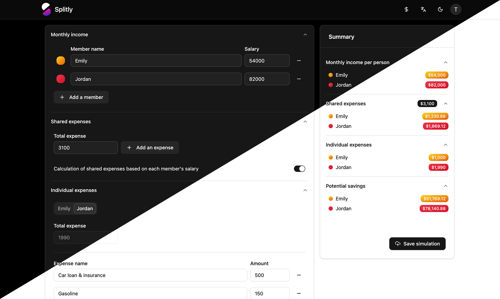

<p align="center">
  
</p>

# Splitly

## 🖼️ Aperçu visuel



**Simulateur de répartition des dépenses**

Splitly est une application web qui permet aux couples ou colocataires de simuler une répartition équitable des dépenses communes en fonction des revenus de chacun. L'objectif est de simplifier la gestion des charges partagées en calculant automatiquement qui paie quoi, selon un prorata personnalisé.

## 🚀 Site en ligne

[Voir le site](https://splitly.theobrissiaud.fr)

## 🌐 Stack technique

* **React 19** avec **Vite**
* **TypeScript**
* **Redux Toolkit** pour la gestion d'état global
* **React Router** pour la navigation
* **Tailwind CSS v4** + **shadcn/ui** pour l'interface
* **Zod** + **React Hook Form** pour la validation des formulaires
* **i18next** pour la gestion multilingue (fr/en)

## ✨ Fonctionnalités principales

* Simulation instantanée des contributions selon les revenus
* Ajout de dépenses récurrentes (loyer, abonnements, etc.)
* Interface responsive claire et moderne
* Dark mode
* Authentification (via Google, GitHub ou email/password)
* Données persistées via une API REST propulsée par Strapi v5

## 📝 Installation locale

```bash
pnpm install
pnpm dev
```

L'application tourne par défaut sur [http://localhost:5173](http://localhost:5173)

## 🎓 Auteur

**Théo Brissiaud**
[LinkedIn](https://www.linkedin.com/in/theobrissiaud) · [Portfolio](https://theobrissiaud.fr)

## ✉️ Licence

MIT — libre d'utilisation et de modification. Voir le fichier [LICENSE](./LICENSE).
